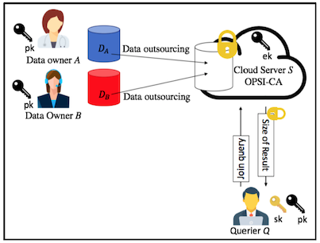
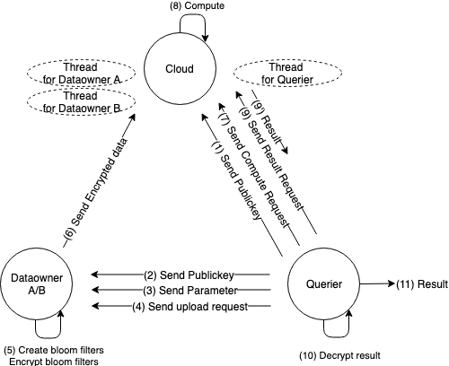
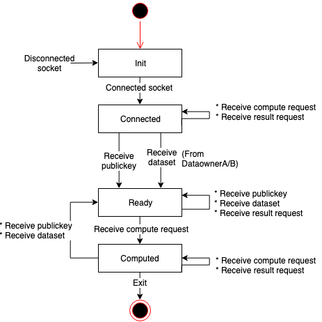
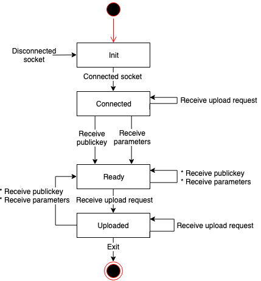

# Outsourced Private Set Intersection Cardinality with Fully Homomorphic Encryption

Implementation of outsourced private set intersection cardinality (OPSI-CA) protocols.



Querier asks the cloud that the two data owners each own a set of elements and perform a join operation to obtain the size of the common elements of the two data sets. This operation is done without exposing the contents of the data to the cloud.

# Prerequisites
* CentOS 7.3
* Linux Kernel 3.10.0
* glibc 2.17
* g++ 4.8.5
* cmake >=2.8
* [HElib](https://github.com/homenc/HElib)
* doxygen (If you generate a document)

# Building
1. Build and install [HElib](https://github.com/homenc/HElib) according to Option 1 in INSTALL.md.
2. Run following command to build the library.
    ```sh
    $ mkdir build && cd build
    $ cmake ..
    $ make
    ```

* Generated files

| File | Content |
|:---|:---|
| opsica_cloud/libopsica_cloud.so | Cloud library |
| opsica_dataowner/libopsica_dataowner.so | Dataowner library |
| opsica_querier/libopsica_querier.so | Querier library |
| demo/cloud/cloud | Cloud demo app |
| demo/dataownerA/dataownerA | DataownerA demo app |
| demo/dataownerB/dataownerB | DataownerB demp app |
| demo/querier/querier | Querier demo app |

# API Reference
* Run following command to build the documentation.
    ```sh
    $ cd doc && doxygen
    ```
* see `doc/html/index.html`

# Demo
Demo app consists of four processes: Cloud, Dataowner A / B and Querier. These processes communicate as shown in the following figure.



## Cloud demo app
* Behavior
    * Cloud receives public key from Querier. (Fig: (1))
    * Cloud receives encrypted data from DataownerA/B. (Fig: (6))
    * Cloud receives compute request from Querier, then compute OPSICA. (Fig: (7),(8)
    * Cloud receives result request from Querier, then return the result to Querier. (Fig: (9))
* Usage
    ```sh
    Usage: ./cloud
    ```
* State Transition Diagram
  * 

## DataownerA/B demo app
* Behavior
    * Each Dataowner receives public key from Querier. (Fig: (2))
    * Each Dataowner receives parameter from Querier. (Fig: (3))
    * Each Dataowner receives upload request from Querier. (Fig: (4))
    * Each Dataowner encrypts the input data specified by `input_filename` and saves it in the directory specified by `output_dir`, then Dataowner sends encrypted data to Cloud. (Fig: (6))
* Usage
    ```sh
    Usage: ./dataownerA [-i input_filename] [-o output_dir]
    Usage: ./dataownerB [-i input_filename] [-o output_dir]
    ```
    * -i input_filename : file path of input data (REQUIRED)
    * -o output_dir : directory for storing encryped data (OPTINAL, Default: `/tmp`)
* State Transition Diagram
  * 

## Querier demo app
* Behavior
    * If the `-c` option is specified, Querier reads the value of the parameter from the configuration file specified by` config_filename`. If it is not specified, it loads the default value.
    * If the `-g` option is specified, Querier generates a Public Key file with the file name specified by` pubkey_filename` and a Secret Key file with file name specified by `seckey_filename`.
    * Querier reads the Public Key file specified by `pubkey_filename`, then send the data to Cloud. (Fig: (1))
    * Querier reads the Public Key file specified by `pubkey_filename`, then  send the data to each Dataowner. (Fig: (2))
    * Querier sends parameters to each Dataowner. (Fig: (3))
    * Querier sends upload request to each Dataowner. (Fig: (4))
    * Querier sends compute request to Cloud. (Fig: (7))
    * Querier sends result request to Cloud, then receives the result from Cloud. (Fig: (9))
    * Querier decrypts the encrypted result, then get the result. (Fig: (10),(11))
* Usage
    ```sh
    Usage: ./querier [-c config_filename] [-p pubkey_filename] [-s seckey_filename] [-g]
    ```
    * -c config_filename : file path of configuration file (OPTIONAL)
    * -p pubkey_filename : file path of public key file (REQUIRED)
    * -s seckey_filename : file path of secret key file (REQUIRED)
    * -g : if this option is specified, it generates a public Key file and a secret Key file. (OPTINAL)
* Configuration
    * Sample: `src/demo/querier/config.txt`
        ```
        nthreads = 2      (Default: 2)
        fpmax    = 0.001  (Default: 0.001)
        fheM     = 30269  (Default: 30269)
        fheL     = 34     (Default: 34)
        fhek     = 128    (Default: 128)
        ```
    * Parameters
        * nthread : number of threads used by Cloud and each Dataowner to calculate
        * fpmax : acceptable maximum false positive rate
        * fheM : polynomial parameter M of phi(M) in FHE
        * fheL : level of FHE

## Demo script
Run following command. Then four processes (Cloud, DataownerA,B, Querier) are started on xterm.
```sh
$ ./demo.sh
```
* In order to run this script, you need an environment where the xterm runs.

# License
Copyright 2018 Yamana Laboratory, Waseda University
Supported by JST CREST Grant Number JPMJCR1503, Japan.

Licensed under the Apache License, Version 2.0 (the "License");
you may not use this file except in compliance with the License.
You may obtain a copy of the License at

http://www.apache.org/licenses/LICENSE-2.0

Unless required by applicable law or agreed to in writing, software
distributed under the License is distributed on an "AS IS" BASIS,
WITHOUT WARRANTIES OR CONDITIONS OF ANY KIND, either express or implied.
See the License for the specific language governing permissions and
limitations under the License.

# References
Arisa Tajima, Hiroki Sato, Hayato Yamana:"Outsourced Private Set Intersection
Cardinality with Fully Homomorphic Encryption," Proc. of 6th International
Conference on Multimedia Computing and Systems (ICMCS2018) (2018.5)


